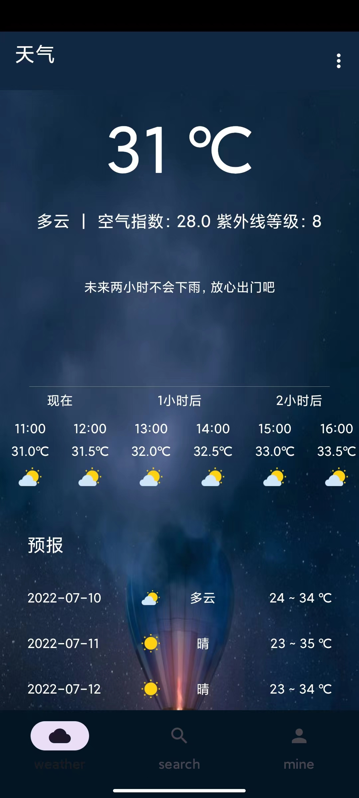
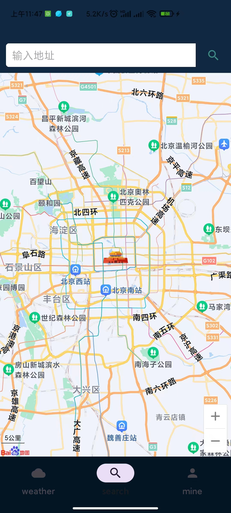
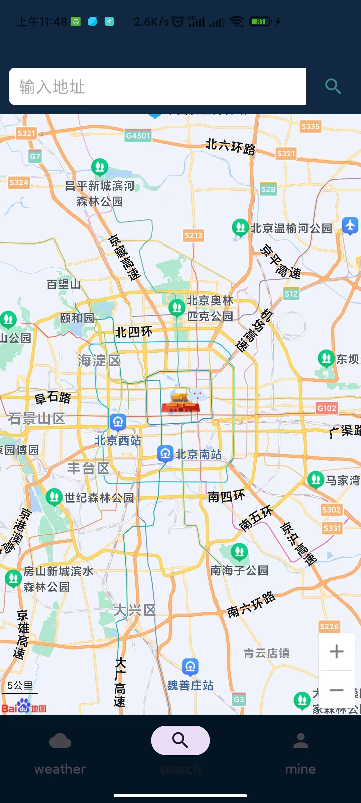
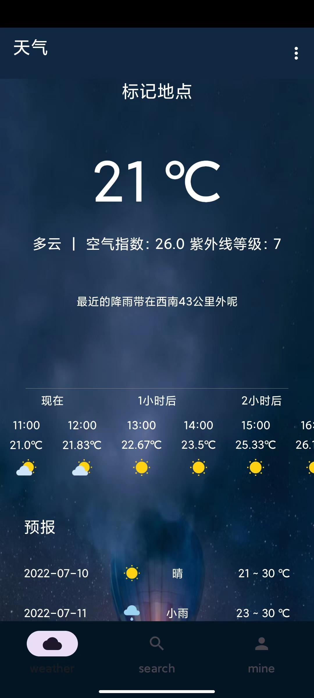
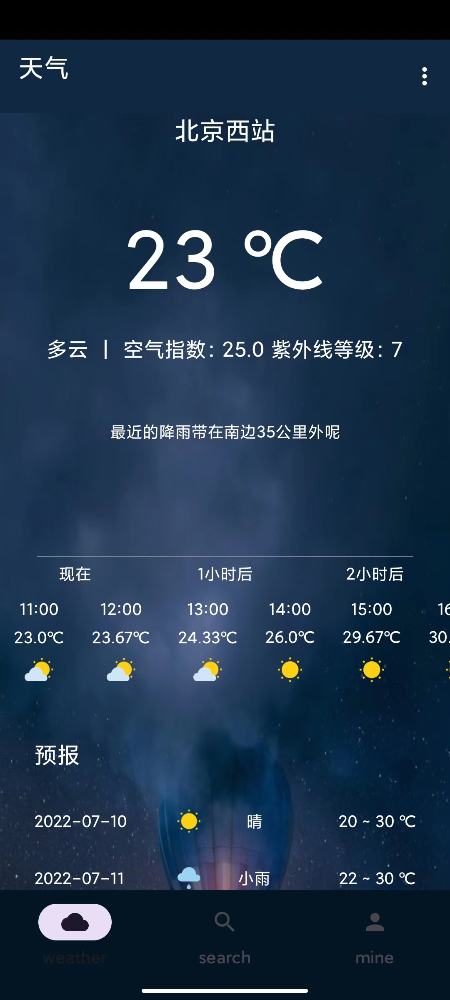
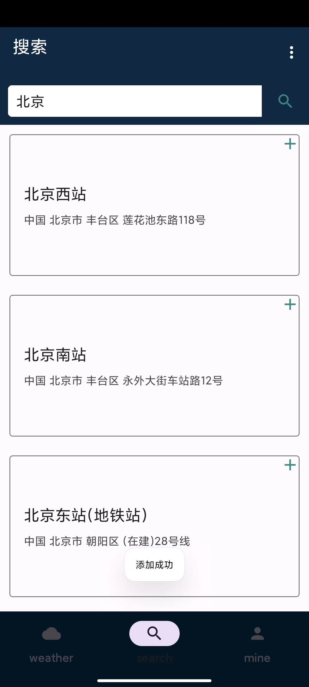

# FijiWeather

天气预报APP

本地定位 实时温度 天气 空气指数 紫外线等级

未来两小时降雨曲线

未来五天天气预测

可以通过地名搜索查询该地区天气

可以通过在地图上标记地点查询天气

通过收藏保存用户常用地天气 方便查询

- 

- 

//使用地图进行标记 长按标记地点 点击右上角放大镜查询该地区天气

- 

- 

- 

- 

- 

- 

- 
